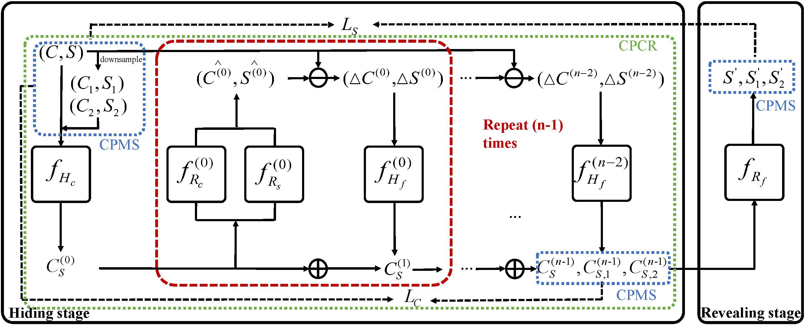
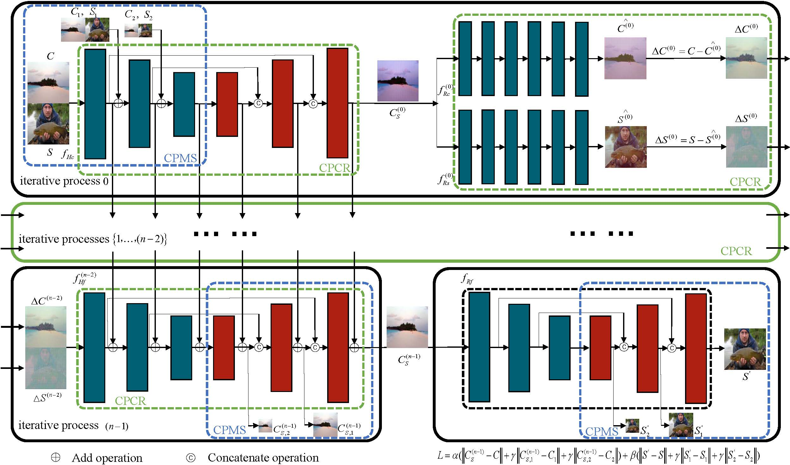

# Joint-adjustment-image-steganography-networks
Official PyTorch implementation of "Joint adjustment image steganography networks"


  


  


## Requirements
This code was developed and tested with Python3.6, Pytorch 1.5 and CUDA 10.2 on Ubuntu 18.04.5.

## Train JAIS-Nets on ImageNet datasets
You are able to run the provided demo code.

1. Prepare the ImageNet datasets and visualization dataset.

2. Change the data path on lines 210-220 of train_dah.py

(Images for training exist in traindir and valdir, and images for visualization exist in coverdir and secretdir ).

3. ```sh train_JAIS_n2.sh ```
   
   (when the numbers of iterative processes in the hiding stage n=2)

   ```sh train_JAIS_n3.sh```
   
   (when the numbers of iterative processes in the hiding stage n=3)

## Citation
If you found our research helpful or influential please consider citing


### BibTeX
@article{zhang2023joint,
  title={Joint adjustment image steganography networks},
  author={Zhang, Le and Lu, Yao and Li, Tong and Lu, Guangming},
  journal={Signal Processing: Image Communication},
  pages={117022},
  year={2023},
  publisher={Elsevier}
}
